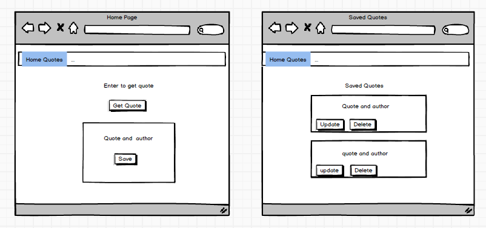

# Inspiration
Think of a problem, click the button and get inspirational words of wisdom to help you out. This project is inspired by a book called "A Guide for the Advanced Soul" Where you concentrate on a problem and open the book to a random page where you will find a quite that should give advice for you. This is a digital version of the same.

## User Stories
* A user can click the 'Get Answer' button and will get a random inspirational quote.
* A user can save a quote to the database
* A user can click on 'qootes' to see a list of all saved quotes.
* A user can update the quote and author for each saved quote.
* A user can delete any saved quote.

## Wireframe

#API
This uses the http://api.forismatic.com API to get random quotes.

##Technology
The backend is built using Ruby on Rails which acts as an API for the front end which calls the backend via AJAX. The data is stored in postgresql. It is styled with Materialize which is implemented via the materialize-sass ruby gem.

